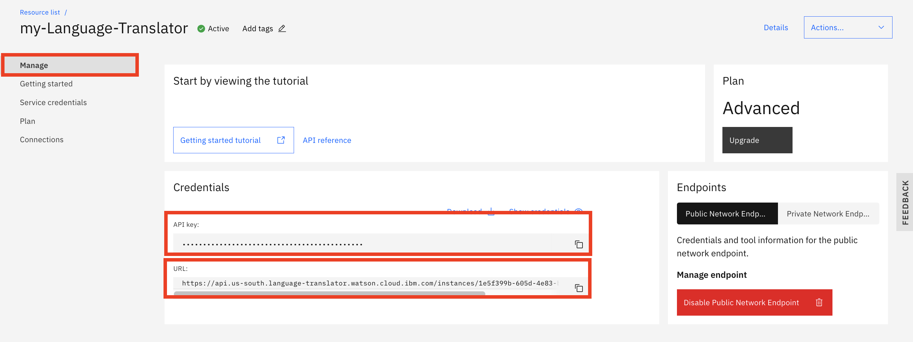

# Create Language Translator Service Instance


## Objective

IBM Watson™ Language Translator allows you to translate text programmatically from one language into another language.

You create an instance of IBM Watson™ Language Translator service in IBM Cloud.


## Tools Used

- Watson Language Translator


## Requirements

- [IBM Cloud Account](https://cloud.ibm.com)


## Steps

To create an instance of IBM Watson™ Language Translator service in IBM Cloud,

1. login to [IBM Cloud](https://cloud.ibm.com).

1. Select [Catalog](https://cloud.ibm.com/catalog) from the top navigation bar.

1. Search for `language translator`.

1. Select the `Language Translator` tile.

1. Select a region, for example `Dallas`.

1. Select an `Advanced` or `Premium` pricing plan.

    > Note: Because, you are going to build a custom model with your dictionary, you must select an `Advanced` or `Premium` pricing plan.

1. Give it a unique name, for example `my-Language-Translator`.

1. Select `Both public & prvate network` for the `Service Endpoints`.

1. Accept the default for the rest of settings.

1. Click `Create` button. This create your `Translator` insstance.


### Setup a terminal environment connecting to `Translator` instance 

The rest of the workshop will use your `Translator` instance created in this section. For simplicity, you are going to connect to your `Translator` instance via `Curl` command in a terminal wiindow. To connect to your `Translator` instance, `API key` and `Endpoint URL` must be set correctly.

1. Go back to the browser where you have created your `Translator` instance.

1. Select `Manage` in the left navigation pane.

1. Both `API key` and `URL` are available on the right.

    

1. Copy the `API key`.

1. Open a terminal window.

1. Execute command

    ```
    export apikey=<your API key>
    ```

1. Copy the `URL`.

1. Execute command below in the terminal window.

    ```
    export url=<your url>
    ```

1. To verify you are connected to an instance `Translator` service, execute the command

    ```
    curl --user "apikey:$apikey" "$url/v3/models?source=en&target=es&version=2018-05-01"
    ```

1. It should return

    ```
    {
        "models" : [ {
            "model_id" : "en-es",
            "source" : "en",
            "target" : "es",
            "base_model_id" : "",
            "domain" : "general",
            "customizable" : true,
            "default_model" : true,
            "owner" : "",
            "status" : "available",
            "name" : "en-es",
            "training_log" : null
        } ]
    }
    ```

1. If the expected result were not returned, reset both `apikey` and `url` environment variable.


## Related Links

There is lots of great information, tutorials, articles, etc on the [IBM Developer site](https://developer.ibm.com) as well as broader web. Here are a subset of good examples related to data understanding, visualization and processing:

- [Getting started with Language Translator](https://cloud.ibm.com/docs/language-translator?topic=language-translator-gettingstarted)
- [IBM Cloud API Docs - Language Translator](https://cloud.ibm.com/apidocs/language-translator)


## General Links

- [IBM Developer](https://developer.ibm.com)
